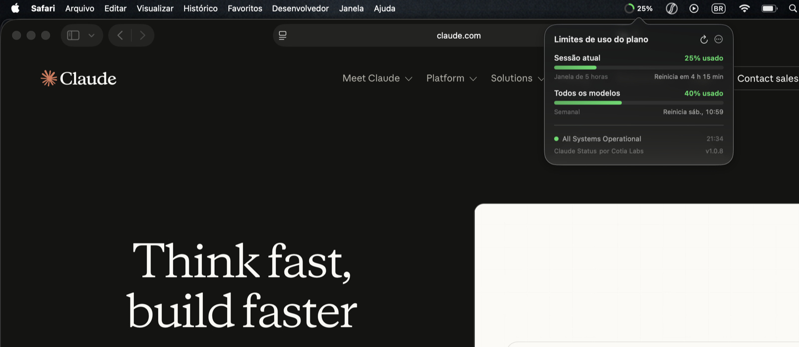

# ClaudeStatusBar



Widget de barra de menus para macOS que mostra, de forma animada, os
**limites de uso do plano Claude** — a mesma informação do `/usage` do
Claude Code — mais o status da plataforma.

Versão atual: **1.0.11** (ver [CHANGELOG.md](CHANGELOG.md)).

## Instalar

Baixe o `.dmg` da [página de Releases][releases] e dê dois cliques em
**Instalar.command** — ele copia o app para Applications, tira a quarentena
e já abre. (Se o macOS bloquear o script, botão direito → Abrir.)

O app é assinado só ad-hoc (sem conta paga de desenvolvedor), então
arrastar para Applications deixa a quarentena no bundle e o Gatekeeper
barra a abertura. Quem preferir arrastar precisa rodar depois:

```bash
xattr -dr com.apple.quarantine /Applications/ClaudeStatusBar.app
```

Requisitos: macOS 13+ e login ativo do Claude Code (`claude auth`).

[releases]: ../../releases/latest

## Build local

```bash
./build-app.sh                    # dist/ClaudeStatusBar.app (arquitetura local)
./build-app.sh --universal --dmg  # binário universal + dist/ClaudeStatusBar-1.0.11.dmg
./build-app.sh --install          # copia para /Applications
open dist/ClaudeStatusBar.app

./.build/release/ClaudeStatusBar --dump      # imprime os números no terminal
./.build/release/ClaudeStatusBar --version   # imprime a versão
./.build/release/ClaudeStatusBar --check-updates  # compara com a última release
```

Precisa da toolchain Swift (Command Line Tools bastam — o `--universal` usa
dois builds por triple + `lipo`, evitando o `xcbuild` do Xcode completo).

## Publicar uma versão

O GitHub Actions faz o build e sobe o artefato:

- **`.github/workflows/ci.yml`** — a cada push em `main` e em cada PR: build,
  empacotamento, verificação de assinatura e smoke test do `--dump`.
- **`.github/workflows/release.yml`** — ao empurrar uma tag `v*` (ou manualmente
  em Actions → Release): build universal, DMG, upload como artefato e anexo à
  Release do GitHub. O job falha se `VERSION` não bater com a tag.

```bash
# 1. atualize VERSION e CHANGELOG.md
git commit -am "Release 1.0.11"
git tag v1.0.11
git push origin main --tags
```

O DMG aparece na Release em poucos minutos, pronto para baixar e instalar.

### Assinatura

Por padrão o build assina ad-hoc, o que basta para rodar na própria máquina.
Com uma conta paga de desenvolvedor, defina `SIGNING_IDENTITY` e a assinatura
sai com hardened runtime e timestamp:

```bash
SIGNING_IDENTITY="Developer ID Application: Cotia Labs (TEAMID)" \
  ./build-app.sh --universal --dmg
```

No CI, o workflow de release importa o certificado para uma keychain
temporária quando estes secrets existem (sem eles, segue ad-hoc):
`SIGNING_CERTIFICATE_P12` (o `.p12` em base64),
`SIGNING_CERTIFICATE_PASSWORD` e `SIGNING_IDENTITY`.

## O que aparece

Na barra: um **anel que enche** com o percentual da **sessão atual** (janela de 5 horas).
Verde → amarelo → laranja → vermelho, com pulsação lenta acima de 95%.
O anel faz easing até o novo valor a cada atualização, nunca salta.
O estilo é escolhido no menu: **anel**, **anel + porcentagem**, **só a
porcentagem** ou **ponto**. O **modo discreto** encolhe tudo para um pontinho
esmaecido enquanto a sessão está abaixo de 25/50/75% — sem nunca esconder o
ícone, que continua clicável.

Com **Reduzir Movimento** ligado em Acessibilidade, o anel salta direto para o
valor, não pulsa em 95%, e as barras do painel não usam spring.

A interface é localizada: **inglês** (base) e **português do Brasil**, seguindo
o idioma do sistema.

Clique abre o painel:

```
Limites de uso do plano
Sessão atual                        53% usado
▓▓▓▓▓▓▓▓▓░░░░░░░░
Janela de 5 horas      Reinicia em 2 h 46 min

Todos os modelos                    35% usado
▓▓▓▓▓▓░░░░░░░░░░░
Semanal                  Reinicia sáb., 11:00

● All Systems Operational                18:04
```

Barras animam com spring ao carregar e a cada mudança de valor, o
percentual usa `contentTransition(.numericText())`, e o contador
"Reinicia em…" corre em tempo real (TimelineView de 1 s).

Clique com o botão direito (ou no `⋯`) abre as opções: intervalo de
atualização (1 / 5 / 15 / 30 min), estilo da barra de menus, modo discreto,
avisos em 80% e 95%, verificação automática de atualizações, abrir no login,
e o link do status page.

## Atualizações

Com o Sparkle configurado (ver abaixo), o app checa o `appcast.xml` do
repositório ao abrir e uma vez por dia, mostra a janela do Sparkle quando há
versão nova, e **baixa e instala sozinho** — sem arrastar DMG. O painel também
mostra a faixa "Versão X disponível". Para desligar a checagem automática, use
"Verificar atualizações automaticamente" no menu.

Sem as chaves do Sparkle no build, o app cai no comportamento antigo: consulta
a API pública de releases do GitHub (sem token, sem telemetria) e avisa por
notificação, com instalação manual.

### Habilitar o auto-update

O Sparkle exige um par de chaves EdDSA; só a pública vai no app.

```bash
# 1. gere o par uma única vez (a privada fica no Keychain e é impressa uma vez)
curl -fsSL https://github.com/sparkle-project/Sparkle/releases/download/2.9.6/Sparkle-2.9.6.tar.xz \
  | tar -xJ -C /tmp && /tmp/bin/generate_keys
```

Guarde as duas nos secrets do repositório:

| Secret | Valor |
| --- | --- |
| `SPARKLE_PUBLIC_ED_KEY` | a chave pública impressa pelo `generate_keys` |
| `SPARKLE_PRIVATE_ED_KEY` | a chave privada (`generate_keys -x -` para exportar) |

A partir daí, cada tag `v*` gera o DMG, assina com a chave privada, atualiza
`appcast.xml` e comita o arquivo em `main` — que é de onde o app lê o feed
(`raw.githubusercontent.com/Cotia-Labs/ClaudeStatusBar/main/appcast.xml`).

Localmente, `SPARKLE_PUBLIC_ED_KEY=… ./build-app.sh` embute o feed; sem a
variável, o app é empacotado sem auto-update de propósito.

## De onde vêm os dados

- **Uso:** `GET https://api.anthropic.com/api/oauth/usage` com o token OAuth
  local (`~/.claude/.credentials.json`, com fallback para o item de keychain
  `Claude Code-credentials`). É o mesmo endpoint que alimenta o `/usage`.
  **API não oficial** — pode mudar sem aviso. O token só sai do processo no
  header `Authorization` para a api.anthropic.com.
- **Status da plataforma:** `status.anthropic.com/api/v2/summary.json`.

O endpoint separa os pedidos por `User-Agent`: qualquer coisa que não pareça
o CLI cai num bucket estreito e devolve 429 persistente. Por isso o app envia
`claude-cli/<versão> (external, cli)` e ainda assim se protege:

- intervalo mínimo de 60 s entre chamadas, independente do que a UI peça
  (abrir o popover reaproveita o valor em cache);
- em 429, respeita `Retry-After` ou dobra a espera até 15 min;
- o "Atualizar agora" fura o cooldown normal, mas nunca o backoff de 429;
- em falha, o painel mantém os últimos números bons esmaecidos com a nota
  "Mostrando dados de …" em vez de apagar tudo.

Intervalos disponíveis: 1 / 5 / 15 / 30 min (padrão 5 min).

## Estrutura

| Arquivo | Papel |
| --- | --- |
| `App.swift` | Entry point, política `.accessory`, flag `--dump` |
| `AppDelegate.swift` | NSStatusItem, popover, menu de opções |
| `MenuBarGauge.swift` | Anel animado desenhado na barra de menus |
| `UsagePanel.swift` | Painel SwiftUI com barras animadas e countdown |
| `UsageStore.swift` | Polling, notificações de limiar, formatadores |
| `UsageFetcher.swift` / `UsageModel.swift` | Endpoint de uso e modelo |
| `Credentials.swift` | Leitura do token OAuth local |
| `StatusFetcher.swift` / `StatusModel.swift` | Status page |
| `AppInfo.swift` | Versão e nome lidos do bundle |
| `Preferences.swift` / `Notifier.swift` | Ajustes e notificações locais |
| `Localization.swift` | Helper `L("…")`; strings em `Resources/*.lproj` |
| `Updater.swift` | Sparkle: appcast, download e instalação in-place |

## Licença

Código aberto para **uso não comercial**, sob a
[PolyForm Noncommercial License 1.0.0](LICENSE.md).

Na prática:

- **Pode** usar, estudar, modificar, redistribuir e publicar forks, desde que
  o propósito não seja comercial e que a licença acompanhe as cópias.
- **Pode** usar sem custo em pesquisa, estudo, projetos pessoais e hobby, e
  dentro de organizações sem fins lucrativos e instituições de ensino.
- **Não pode** usar em produto ou serviço comercial, vender, embutir em
  software pago, nem usar em atividade que gere receita para uma empresa.

Para uso comercial, procure os mantenedores para uma licença à parte.

Nota: por restringir o uso comercial, a PolyForm Noncommercial não é
considerada "open source" pela definição da OSI (nem "livre" pela FSF) — o
código é público e modificável, mas com essa limitação de finalidade.

Copyright 2026 Cotia Labs.
